# Onboarding für Gastronomen

Diese Anleitung erklärt Schritt für Schritt, wie Sie die Anwendung nutzen. Sie brauchen dafür keine Technik-Kenntnisse.

> **Wichtig: Testmodus.** Die Anwendung läuft derzeit im **Testmodus**. Es fließt **kein echtes Geld**. Gäste zahlen mit Test-Karten. Alle Bilder in dieser Anleitung zeigen das erfundene Restaurant "Trattoria Da Mario" mit Demo-Daten. Die Bestellungen von "Test Gast" sind Test-Bestellungen.

## Inhalt

1. [Was ist diese Anwendung und was habe ich davon?](#1-was-ist-diese-anwendung-und-was-habe-ich-davon)
2. [So läuft eine Bestellung ab](#2-so-läuft-eine-bestellung-ab)
3. [Erste Schritte in 30 Minuten](#3-erste-schritte-in-30-minuten)
4. [Jeder Menüpunkt der Verwaltung erklärt](#4-jeder-menüpunkt-der-verwaltung-erklärt)
5. [Der Alltag](#5-der-alltag)
6. [Rollen und Rechte](#6-rollen-und-rechte)
7. [Zahlungen](#7-zahlungen)
8. [Datenschutz und Cookies](#8-datenschutz-und-cookies)
9. [Barrierefreiheit](#9-barrierefreiheit)
10. [Häufige Fragen](#10-häufige-fragen)
11. [Wo bekomme ich Hilfe? Und Glossar](#11-wo-bekomme-ich-hilfe-und-glossar)

---

## 1. Was ist diese Anwendung und was habe ich davon?

Die Anwendung (Arbeitsname "gastro-saas") ist eine digitale Speisekarte mit Bestellung und Bezahlung. Ihre Gäste scannen einen QR-Code, sehen Ihre Speisekarte, bestellen und zahlen mit dem Handy. Sie sehen jede Bestellung sofort auf einer Übersicht und führen sie Schritt für Schritt weiter. Der Gast sieht den Fortschritt auf seinem Handy. Außerdem sehen Sie Umsatz-Zahlen und Bewertungen und können Ihr Team einladen. Sie sparen Papierkarten, Zettelwirtschaft und Rückfragen.

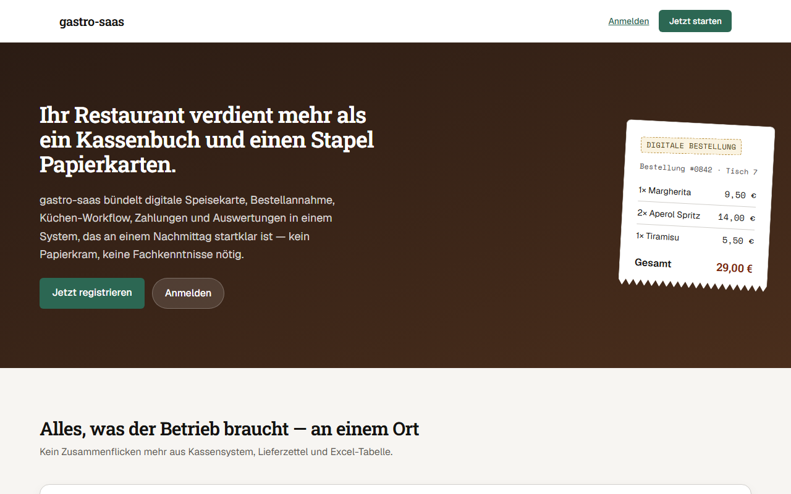

_Abbildung 1: Die Startseite. Hier registrieren Sie sich oder melden sich an._

---

## 2. So läuft eine Bestellung ab

Hier sehen Sie den Weg einer Bestellung aus Sicht des Gastes. Die Bilder zeigen die Ansicht auf dem Handy. Zu jedem Schritt steht auch, was Sie als Restaurant dabei sehen.

### Schritt 1: QR-Code scannen

**Der Gast** scannt den QR-Code auf dem Tisch, auf der Theke oder auf einem Flyer. Die Speisekarte Ihres Restaurants öffnet sich im Browser. Eine App muss er nicht installieren.

**Sie als Restaurant** erzeugen und drucken die QR-Codes selbst (siehe [QR-Code](#qr-code)).

Beim ersten Besuch erscheint ein Hinweis zu Cookies:

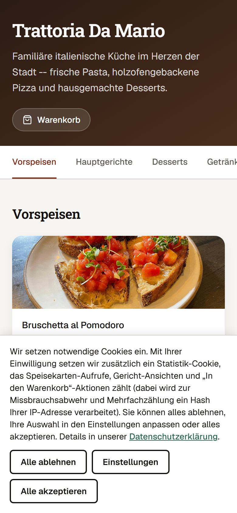

_Abbildung 2: Der Cookie-Hinweis. Der Gast kann alles ablehnen. Mehr dazu in [Abschnitt 8](#8-datenschutz-und-cookies)._

### Schritt 2: Speisekarte ansehen

**Der Gast** sieht Name und Beschreibung Ihres Restaurants. Oben stehen die Kategorien (hier Vorspeisen, Hauptgerichte, Desserts, Getränke). Darunter folgen die Gerichte mit Foto, Beschreibung und Preis. Mit dem Plus-Knopf legt er ein Gericht in den Warenkorb.

**Sie als Restaurant** pflegen die Karte unter [Speisekarte](#speisekarte). Der Gast sieht nur die **veröffentlichte** Version.

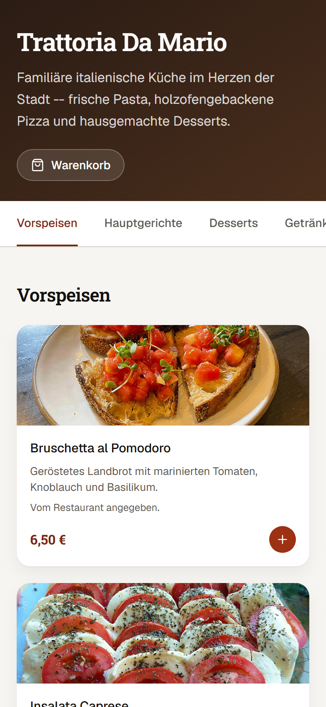

_Abbildung 3: Die Speisekarte aus Sicht des Gastes._

### Schritt 3: Warenkorb

**Der Gast** sieht seine Auswahl. Er kann die Menge ändern ("Aktualisieren") oder ein Gericht entfernen. Die Gesamtsumme steht darunter. Mit "Zur Kasse" geht es weiter.

**Sie als Restaurant** sehen noch nichts. Der Warenkorb gehört nur dem Gast.

> **Gut zu wissen:** Die Summe wird vom System selbst berechnet. Der Gast kann den Preis nicht verändern.

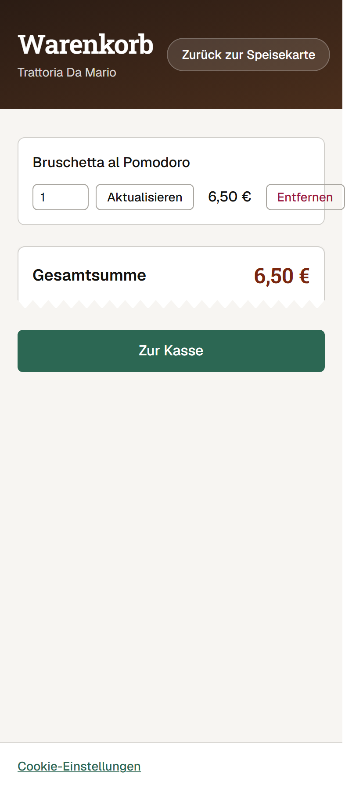

_Abbildung 4: Der Warenkorb._

### Schritt 4: Kasse

**Der Gast** gibt seinen Namen ein. Telefonnummer und Hinweis sind freiwillig. Er wählt "Online bestellen & abholen" oder "Am Tisch bestellen". Er setzt ein Häkchen bei AGB und Datenschutzerklärung und tippt auf "Weiter zur Zahlung".

**Sie als Restaurant** sehen die Bestellung erst nach der Zahlung (siehe Schritt 5).

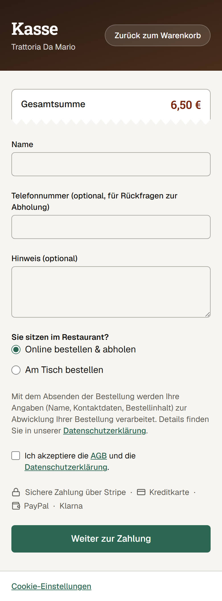

_Abbildung 5: Die Kasse. Auf dem Bild steht "Sichere Zahlung über Stripe" mit Kreditkarte und Klarna (der Screenshot zeigt noch einen älteren Stand mit PayPal; PayPal wird derzeit nicht angeboten). Welche weiteren Zahlarten wirklich angeboten werden, hängt von den Einstellungen bei Stripe ab._

### Schritt 5: Bezahlen

**Der Gast** wird zur Bezahlseite von Stripe weitergeleitet und zahlt dort. **Im Testmodus** nutzt er eine Test-Karte. Es wird kein Geld abgebucht. Die Kartendaten sehen weder Sie noch die Anwendung. Sie gehen nur an Stripe.

**Sie als Restaurant** sehen die Bestellung als bezahlt, sobald Stripe die Zahlung bestätigt hat. Dass der Gast auf die Seite zurückkehrt, reicht dafür nicht. So wird nichts als "bezahlt" gezeigt, was nicht bezahlt ist.

### Schritt 6: Bestellstatus

**Der Gast** sieht eine Seite mit dem Status ("Bestellung eingegangen"), einer Bestellnummer, den bestellten Artikeln und einem Verlauf. Die Seite aktualisiert sich von selbst, wenn Sie den Status ändern.

**Sie als Restaurant** sehen die Bestellung auf der Seite [Bestellungen](#bestellungen) in der Spalte "Neu" und führen sie Schritt für Schritt weiter.

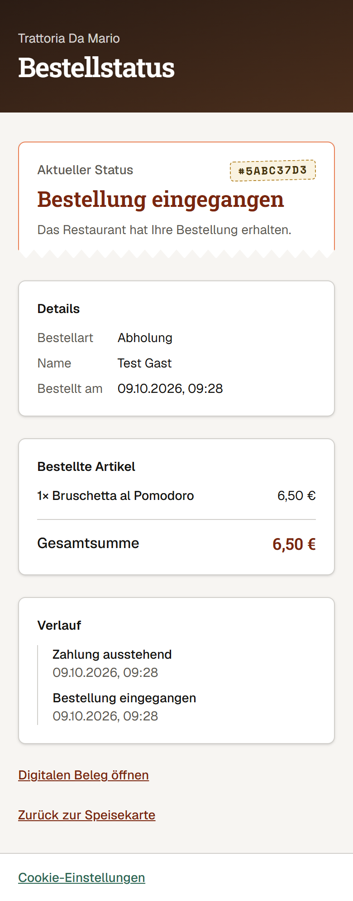

_Abbildung 6: Der Bestellstatus. Im Verlauf steht im Bild noch "Zahlung ausstehend", weil das Bild direkt nach dem Bestellen entstand._

### Schritt 7: Beleg

**Der Gast** kann über "Digitalen Beleg öffnen" einen Beleg ansehen, drucken oder als PDF speichern. Den Beleg gibt es erst, wenn die Bestellung bezahlt ist.

**Sie als Restaurant** müssen dafür nichts tun.

> **Achtung:** Der Beleg ist ausdrücklich **kein steuerlich qualifizierter Kassenbeleg**. Das steht so auf dem Beleg. Wie Sie Ihre steuerlichen Pflichten erfüllen, klären Sie bitte mit Ihrer Steuerberatung.

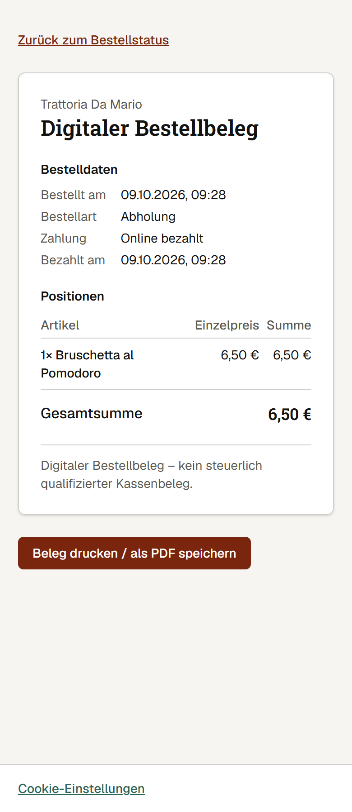

_Abbildung 7: Der digitale Bestellbeleg._

---

## 3. Erste Schritte in 30 Minuten

Planen Sie eine halbe Stunde ein. Halten Sie Ihre Speisekarte und ein paar Fotos bereit.

### 1. Registrieren (ca. 3 Minuten)

1. Öffnen Sie die Startseite und klicken Sie auf **Jetzt registrieren**.
2. Tragen Sie Restaurantnamen, die Web-Adresse Ihres Restaurants, Ihre E-Mail-Adresse und ein Passwort ein. Die Web-Adresse wird Teil des Links zu Ihrer Speisekarte, zum Beispiel `mein-restaurant`.
3. Setzen Sie das Häkchen bei AGB und Datenschutzerklärung. Klicken Sie auf **Registrieren**.
4. Sie werden automatisch **Inhaber** Ihres Restaurants.

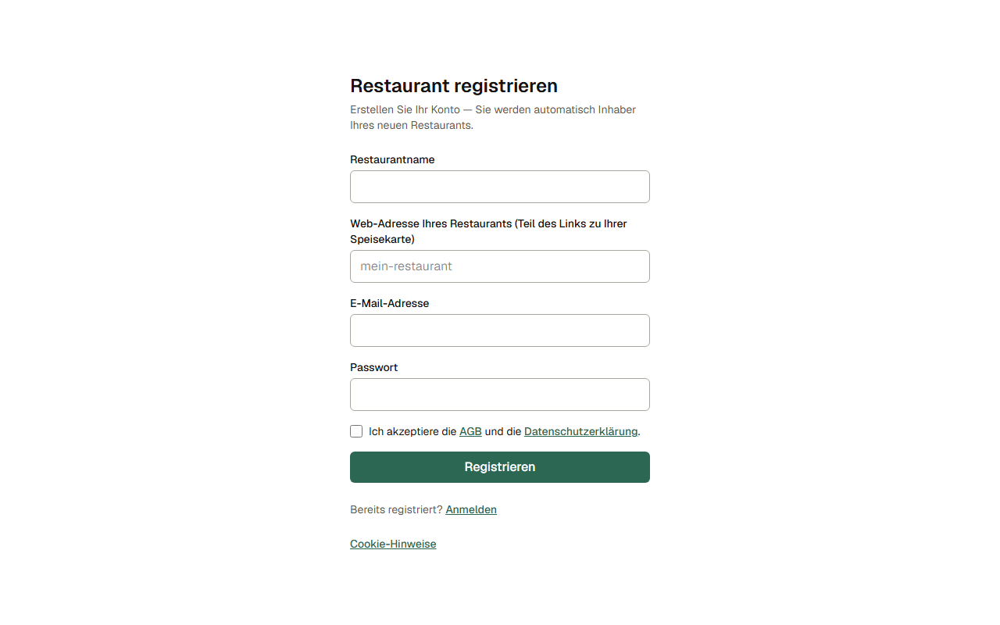

_Abbildung 8: Das Registrierformular._

> **Tipp:** Möglicherweise erhalten Sie nach der Registrierung zuerst eine Bestätigungs-E-Mail. Bestätigen Sie diese und melden Sie sich danach an. Ihr Restaurant wird dann beim ersten Anmelden angelegt.

> **Tipp:** Wählen Sie ein gutes Passwort und geben Sie es nicht weiter. Eine Funktion "Passwort vergessen" gibt es **noch nicht** (siehe [Häufige Fragen](#10-häufige-fragen)).

### 2. Profil und Öffnungszeiten (ca. 5 Minuten)

Gehen Sie auf **Profil**. Tragen Sie Name, Beschreibung, Kontakt-E-Mail, Telefonnummer und Öffnungszeiten ein. Mehr dazu unter [Profil](#profil).

### 3. Speisekarte aufbauen (ca. 10 Minuten)

Gehen Sie auf **Speisekarte**. Legen Sie zuerst Kategorien an (zum Beispiel "Vorspeisen"), dann Gerichte mit Preis. Bei jedem Gericht können Sie Foto, Allergene, Varianten und Extras hinterlegen.

### 4. Qualitätsprüfung

Klicken Sie unter "Vorschau & Veröffentlichen" auf **Qualitätsprüfung ausführen**. Das System prüft Ihre Karte auf Lücken. Erst danach ist der Knopf "Veröffentlichen" frei. Bis dahin steht dort: "Bitte führen Sie zuerst die Qualitätsprüfung aus."

### 5. Veröffentlichen

Klicken Sie auf **Veröffentlichen**. Ab jetzt sehen Ihre Gäste die Karte. Was "Entwurf" und "veröffentlicht" bedeutet, steht im Abschnitt [Speisekarte](#speisekarte).

### 6. Zahlungen verbinden (ca. 5 Minuten)

Gehen Sie auf **Zahlungen** und starten Sie die Verbindung mit Stripe. Sie werden durch Fragen zu Ihrem Unternehmen und Ihrem Bankkonto geführt. Ohne diese Verbindung können Gäste nicht bezahlen. Details in [Abschnitt 7](#7-zahlungen).

### 7. QR-Code drucken (ca. 3 Minuten)

Gehen Sie auf **QR-Code**, tragen Sie die Tischnummer ein und laden Sie den Code herunter. Drucken Sie ihn aus und stellen Sie ihn auf den Tisch.

### 8. Mitarbeiter einladen (ca. 2 Minuten)

Auf der **Übersicht** tragen Sie die E-Mail-Adresse ein, wählen eine Rolle und klicken auf **Einladung senden**.

### Kurze Abschlussprobe

Bestellen Sie einmal selbst mit dem Handy über Ihren QR-Code und bezahlen Sie mit einer Test-Karte. So sehen Sie den Ablauf aus beiden Sichten.

---

## 4. Jeder Menüpunkt der Verwaltung erklärt

Oben in der Verwaltung sehen Sie diese Menüpunkte: **Übersicht, Speisekarte, Bestellungen, Zahlungen, Analytics, Bewertungen, Integrationen, Datenschutz, Profil, QR-Code**. Welche Seiten Sie öffnen dürfen, hängt von Ihrer [Rolle](#6-rollen-und-rechte) ab.

### Übersicht

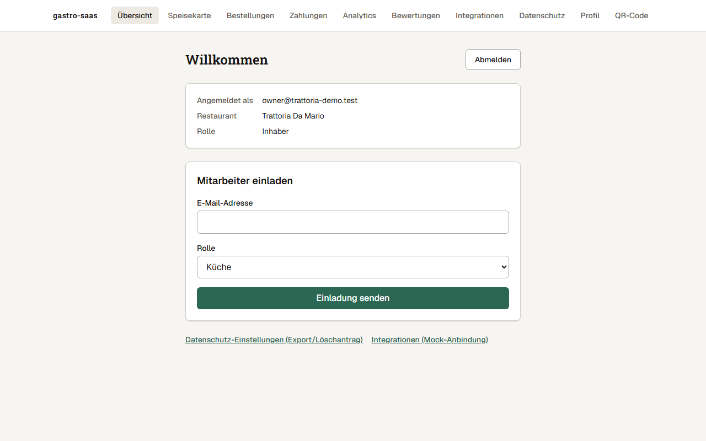

_Abbildung 9: Die Übersicht._

**Wofür?** Startseite nach der Anmeldung. Sie sehen, mit welchem Konto, in welchem Restaurant und mit welcher Rolle Sie angemeldet sind. Hier laden Sie auch Mitarbeiter ein und melden sich ab.

**So geht's:**

1. E-Mail-Adresse der Person eintragen.
2. Rolle wählen (im Bild steht "Küche" vorausgewählt).
3. **Einladung senden** klicken.

**Worauf achten:**

- Vergeben Sie nur die Rolle, die die Person wirklich braucht.
- Laden Sie nur Personen ein, die Sie kennen.
- Melden Sie sich an gemeinsam genutzten Geräten mit **Abmelden** ab.

### Speisekarte

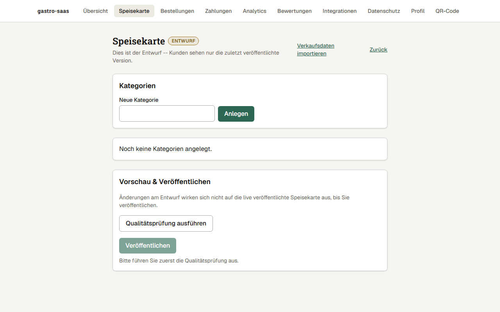

_Abbildung 10: Die Speisekarte in der Verwaltung. Im Bild ist der Entwurf noch leer._

**Wofür?** Hier bauen Sie Ihre Karte auf: Kategorien, Gerichte, Preise, Fotos, Allergene, Varianten und Extras.

**Entwurf und veröffentlicht, einfach erklärt:** Alles, was Sie hier bearbeiten, ist zuerst ein **Entwurf**. Das ist Ihr Arbeitsstand. Im Bild steht dazu: "Dies ist der Entwurf – Kunden sehen nur die zuletzt veröffentlichte Version." Ihre Gäste sehen den Entwurf also **nicht**. Erst wenn Sie auf **Veröffentlichen** klicken, wird der Entwurf für alle sichtbar. So können Sie in Ruhe ändern, ohne dass Gäste halbfertige Karten sehen.

**So geht's:**

1. Unter "Neue Kategorie" einen Namen eingeben und auf **Anlegen** klicken.
2. Gerichte anlegen. Der Preis wird **in Cent** eingegeben (6,50 Euro sind also 650).
3. Beim Gericht (eigene Seite) Foto, Allergene, Varianten und Extras pflegen. Dort können Sie ein Gericht auch als **Ausverkauft** markieren und wieder auf **Verfügbar** stellen.
4. **Qualitätsprüfung ausführen** klicken und Hinweise beheben.
5. **Veröffentlichen** klicken.

**Worauf achten:**

- Nach Änderungen an Gerichten oder Preisen müssen Sie erneut **veröffentlichen**, sonst bleibt die alte Karte für Gäste sichtbar.
- Laden Sie nur Fotos hoch, die Sie selbst gemacht haben oder für die Sie die Rechte besitzen.
- Pflegen Sie Allergene sorgfältig. Für richtige Angaben sind Sie verantwortlich.
- Über **Verkaufsdaten importieren** können Sie eine Excel- oder CSV-Datei mit Verkäufen einlesen. Das dient den Auswertungen unter Analytics.

### Bestellungen

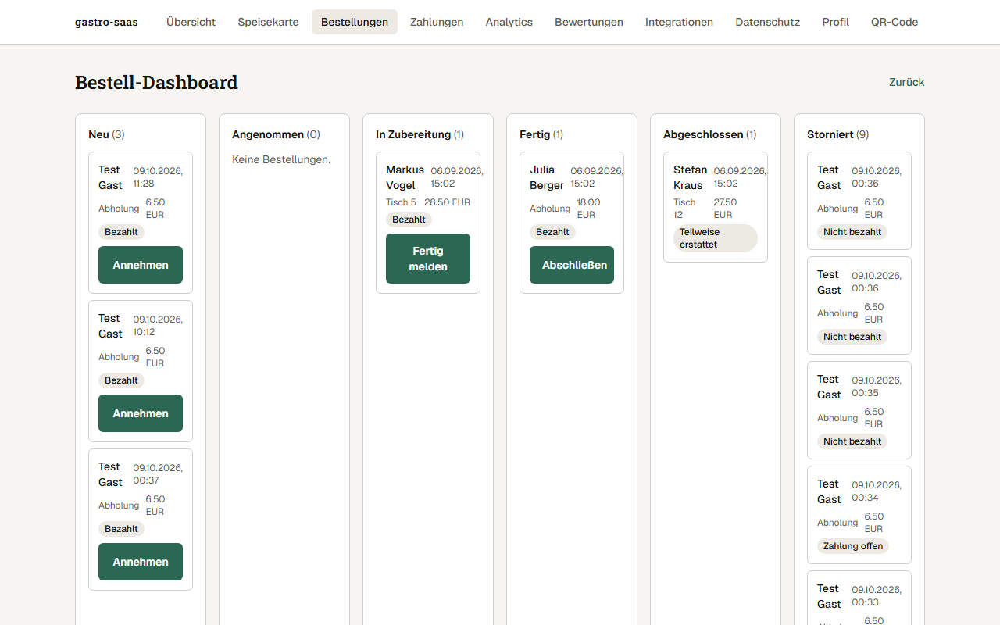

_Abbildung 11: Das Bestell-Dashboard. Die Bestellungen von "Test Gast" sind Test-Bestellungen._

**Wofür?** Die Live-Übersicht für Küche und Service. Jede Bestellung ist eine Karte. Die Spalten zeigen den Stand: **Neu, Angenommen, In Zubereitung, Fertig, Abgeschlossen, Storniert**. Auf jeder Karte stehen Name, Uhrzeit, Art (Abholung oder Tisch), Betrag und der Zahlungsstand.

**So geht's:**

1. Neue Bestellung: **Annehmen** klicken.
2. Wenn die Küche beginnt oder fertig ist: den Knopf auf der Karte klicken (zum Beispiel **Fertig melden**).
3. Wenn der Gast alles hat: **Abschließen** klicken.

Der Gast sieht jeden Schritt auf seinem Bestellstatus.

**Worauf achten:**

- Kennzeichen wie "Bezahlt", "Nicht bezahlt" oder "Zahlung offen" zeigen den Zahlungsstand. Bereiten Sie nur Bestellungen zu, die als **Bezahlt** gekennzeichnet sind.
- "Teilweise erstattet" heißt, dass ein Teil des Betrags zurückgezahlt wurde.
- Ein Knopf zum Stornieren ist auf den Karten **noch nicht verfügbar** (siehe [Häufige Fragen](#10-häufige-fragen)).

### Zahlungen

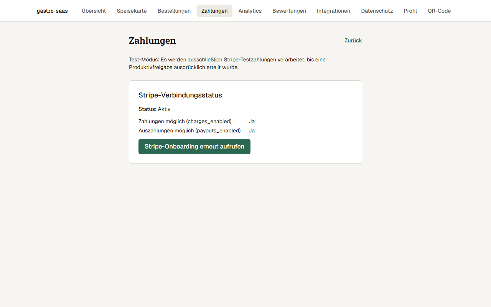

_Abbildung 12: Die Seite Zahlungen im Testmodus._

**Wofür?** Hier verbinden Sie Ihr Restaurant mit dem Zahlungsdienst Stripe und sehen, ob Zahlungen und Auszahlungen möglich sind.

**So geht's:**

1. Den Knopf zum Starten der Verbindung klicken. Ist sie schon eingerichtet, heißt er "Stripe-Onboarding erneut aufrufen".
2. Bei Stripe Ihre Angaben machen und bestätigen.
3. Zurück auf der Seite prüfen: Status **Aktiv**, "Zahlungen möglich: Ja", "Auszahlungen möglich: Ja".

**Worauf achten:**

- Der Hinweis "Test-Modus" oben heißt: Es werden **nur Test-Zahlungen** verarbeitet.
- Steht dort "Nein", fehlen bei Stripe vermutlich noch Angaben von Ihnen.
- Die Verbindung richtet der Inhaber ein. Andere Rollen sehen diese Seite nur, wenn sie das Recht dazu haben.

### Analytics

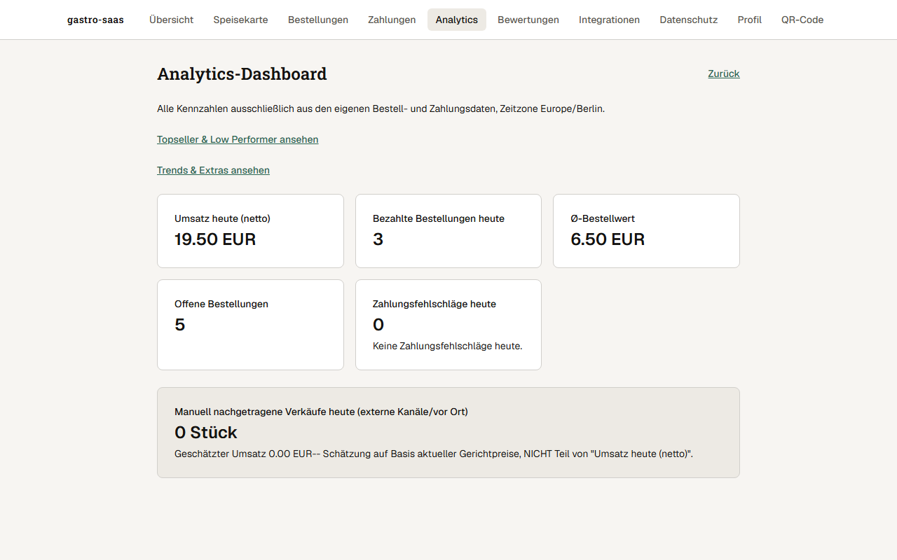

_Abbildung 13: Die Kennzahlen des Tages._

**Wofür?** Zahlen auf einen Blick: Umsatz heute (netto), bezahlte Bestellungen, durchschnittlicher Bestellwert, offene Bestellungen und Zahlungsfehlschläge. Zwei Links führen zu **Topseller & Low Performer** (was gut und was schlecht läuft) sowie **Trends & Extras**.

**So geht's:** Seite öffnen und lesen. Eingaben sind hier nicht nötig.

**Worauf achten:**

- Die Zahlen stammen nur aus den Bestellungen und Zahlungen dieser Anwendung, nicht aus Ihrer Kasse.
- **Manuell nachgetragene Verkäufe** (externe Kanäle oder vor Ort) sind nur eine Schätzung und zählen **nicht** zum Umsatz heute.
- In der Demo sind die Zahlen Test-Werte und sagen nichts über echten Umsatz.

### Bewertungen

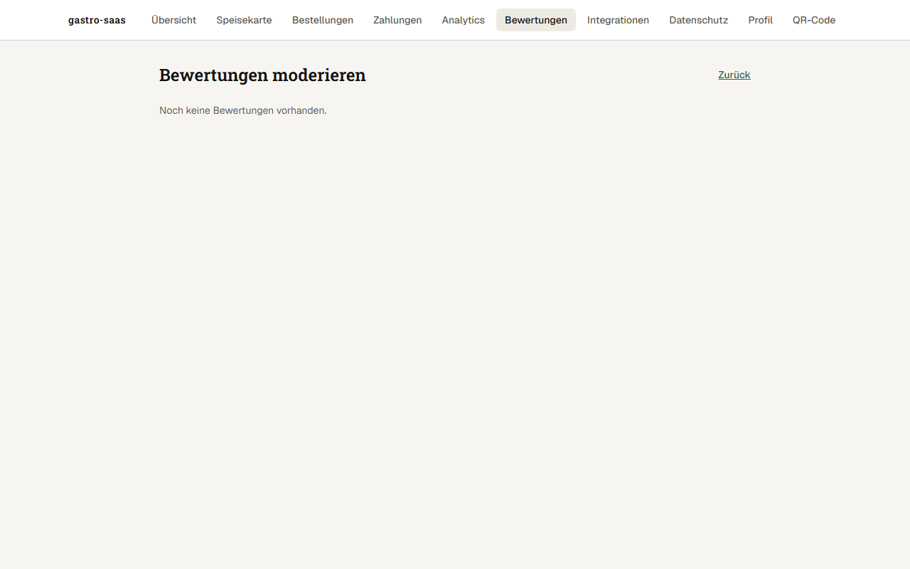

_Abbildung 14: Die Bewertungen. Im Bild gibt es noch keine._

**Wofür?** Gäste können Bewertungen abgeben. Auf dieser Seite prüfen und moderieren Sie diese.

**So geht's:** Neue Bewertungen erscheinen in der Liste. Entscheiden Sie dort für jede Bewertung, wie damit verfahren wird.

**Worauf achten:**

- Bleiben Sie sachlich. Ehrliche Kritik sollten Sie nicht einfach unterdrücken.
- Rechtswidrige Inhalte, zum Beispiel Beleidigungen, sollten Sie nicht freigeben.

### Integrationen

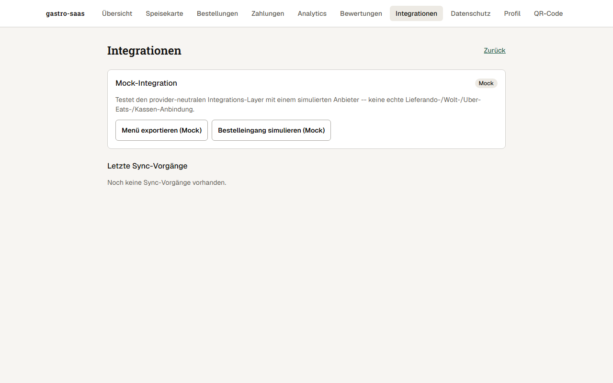

_Abbildung 15: Die Seite Integrationen._

**Wofür?** Gedacht für spätere Anbindungen an andere Systeme.

> **Noch nicht verfügbar:** Es gibt **keine echte Anbindung** an Lieferando, Wolt, Uber Eats oder Kassensysteme. Das steht auch auf der Seite. Sie enthält nur eine **Test-Anbindung ("Mock")** mit einem simulierten Anbieter. Sie können damit nichts Reales verbinden und die Seite im Alltag ignorieren.

### Datenschutz

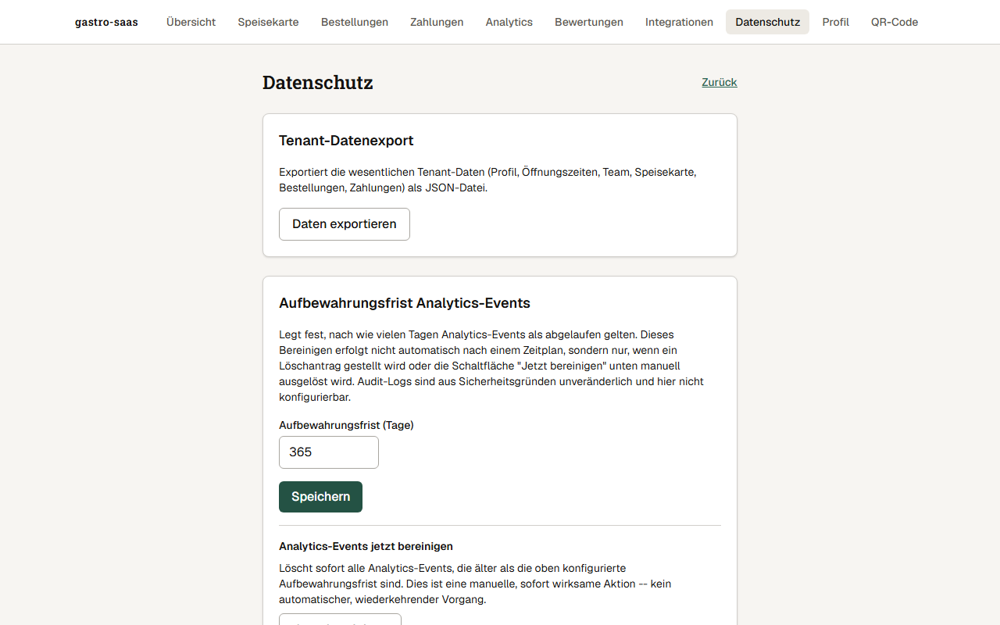

_Abbildung 16: Die Datenschutz-Einstellungen der Verwaltung. Das Wort "Tenant" bedeutet hier Ihr Restaurant._

**Wofür?** Hier können Sie die Daten Ihres Restaurants (Profil, Öffnungszeiten, Team, Speisekarte, Bestellungen, Zahlungen) als Datei exportieren. Außerdem legen Sie fest, wie lange Statistik-Ereignisse als aktuell gelten (im Bild: 365 Tage). Auf der Seite finden Sie weiter unten außerdem Möglichkeiten zum Bereinigen und zum Löschantrag.

**So geht's:**

1. **Daten exportieren** klicken. Eine Datei wird heruntergeladen.
2. Aufbewahrungsfrist in Tagen eintragen und **Speichern** klicken.

**Worauf achten:**

- Das Bereinigen alter Statistik-Daten läuft **nicht von selbst nach Zeitplan**. Es passiert nur, wenn Sie es auslösen oder einen Löschantrag stellen.
- Ein Löschantrag ist ein ernster Schritt. Sprechen Sie ihn vorher intern ab.
- Diese Seite ist nur für bestimmte Rollen sichtbar.

### Profil

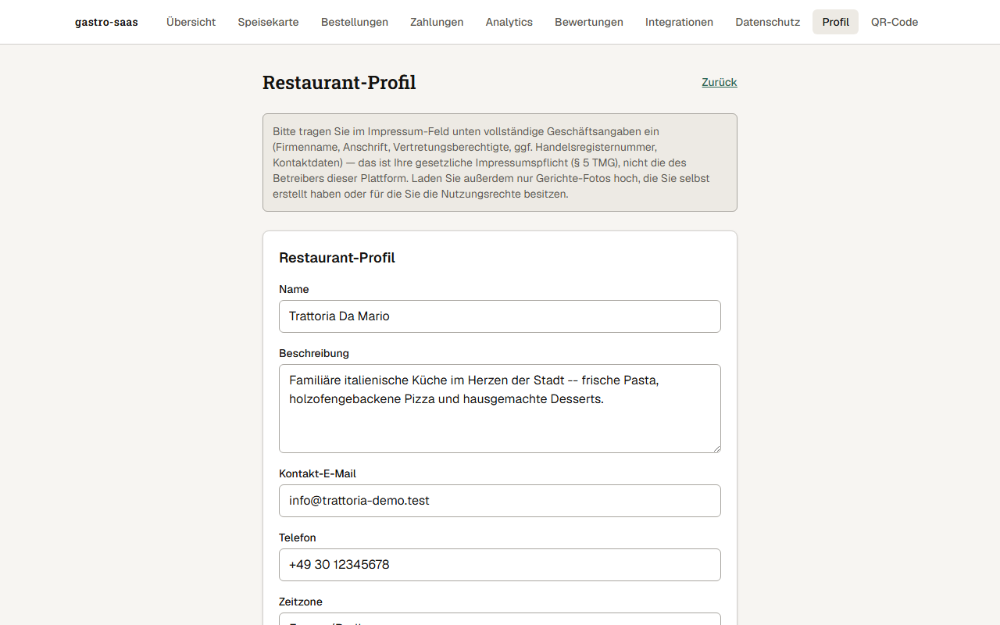

_Abbildung 17: Das Restaurant-Profil._

**Wofür?** Hier pflegen Sie die Angaben, die Gäste sehen: Name, Beschreibung, Kontakt-E-Mail, Telefon, Zeitzone, Markenfarbe, **Öffnungszeiten** und die drei Rechtstexte **Impressum, Datenschutzerklärung und AGB** Ihres Restaurants.

**So geht's:** Felder ausfüllen und speichern. Die Öffnungszeiten tragen Sie pro Wochentag ein.

**Worauf achten:**

> **Wichtig:** Die Texte für Impressum, Datenschutz und AGB sind **Ihre eigenen** rechtlichen Texte. Sie müssen vollständig und richtig sein. Für das Impressum gehören zum Beispiel Firmenname, Anschrift, Vertretungsberechtigte, gegebenenfalls Handelsregisternummer und Kontaktdaten dazu. So steht es auch im Hinweis oben auf der Seite. Die Anwendung erstellt diese Texte nicht für Sie. Lassen Sie sie prüfen (siehe [Abschnitt 8](#8-datenschutz-und-cookies)).

### QR-Code

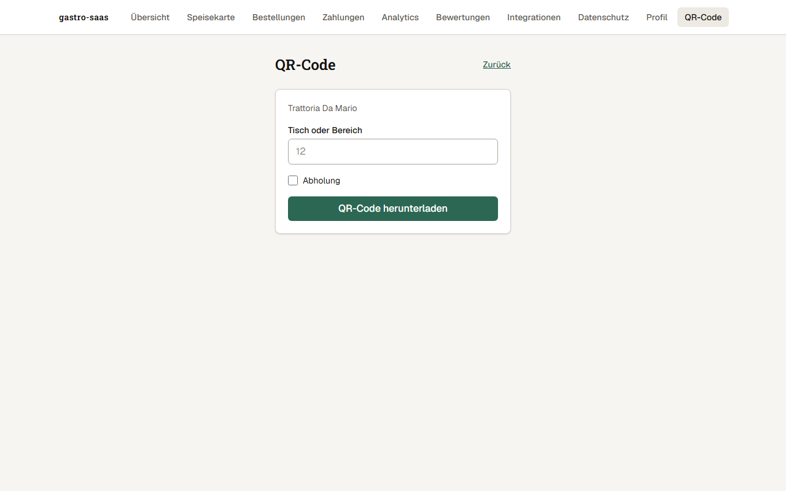

_Abbildung 18: Die Seite zum Erzeugen von QR-Codes._

**Wofür?** Der QR-Code führt den Gast zur Speisekarte Ihres Restaurants. Sie können für jeden Tisch oder Bereich einen eigenen Code erzeugen.

**So geht's:**

1. Tisch oder Bereich eintragen (im Bild steht als Beispiel 12).
2. Für einen Code zur Abholung das Kästchen **Abholung** anhaken.
3. **QR-Code herunterladen** klicken und die Datei drucken.

**Worauf achten:**

- Testen Sie jeden gedruckten Code einmal mit Ihrem Handy.
- Drucken Sie den Code groß genug.
- Geben Sie jedem Tisch den passenden Code. Sonst landet die Bestellung am falschen Tisch.

---

## 5. Der Alltag

### Vor der Öffnung

- [ ] Anmelden und **Bestellungen** öffnen.
- [ ] Prüfen, ob die Speisekarte stimmt (Preise, Gerichte).
- [ ] Gerichte, die heute fehlen, auf **Ausverkauft** setzen.
- [ ] Prüfen, ob die Seite **Zahlungen** den Status "Aktiv" zeigt.

### Während des Betriebs

- [ ] Neue Bestellungen **annehmen**.
- [ ] Bestellungen über "In Zubereitung" und "Fertig" weiterschieben.
- [ ] Fertige Bestellungen **abschließen**, sobald der Gast sie hat.
- [ ] Gerichte sofort als **Ausverkauft** markieren, wenn sie aus sind.

### Nach Feierabend

- [ ] Prüfen, dass keine Bestellung offen in "Neu" oder "Angenommen" hängt.
- [ ] Unter **Analytics** den Tagesumsatz ansehen.
- [ ] Mit **Abmelden** den Zugang beenden, wenn das Gerät geteilt wird.

### Einmal pro Woche

- [ ] **Bewertungen** durchsehen.
- [ ] **Analytics**: Topseller und Low Performer ansehen. Karte bei Bedarf anpassen und neu veröffentlichen.
- [ ] Prüfen, ob Preise, Öffnungszeiten und Allergene noch stimmen.
- [ ] Prüfen, ob alle eingeladenen Personen noch zum Team gehören.

---

## 6. Rollen und Rechte

Eine **Rolle** bestimmt, was eine Person in der Verwaltung tun darf. Sie wählen die Rolle beim Einladen. Diese Standard-Rollen gibt es:

| Rolle                | Wofür gedacht             | Darf zum Beispiel                                                                                                                                   |
| -------------------- | ------------------------- | --------------------------------------------------------------------------------------------------------------------------------------------------- |
| **Inhaber**          | Besitzer, volle Kontrolle | Alles                                                                                                                                               |
| **Geschäftsführung** | Leitung im Tagesgeschäft  | Mitarbeiter einladen, Karte veröffentlichen, Bestellungen bearbeiten, Rückerstattungen, Zahlungsstatus sehen, Analytics, Bewertungen, Integrationen |
| **Küche**            | Zubereitung               | Bestellungen sehen und weiterschieben, Gerichte als ausverkauft markieren, Bestellungen stornieren                                                  |
| **Service**          | Bedienung                 | Bestellungen sehen und weiterschieben, Gerichte als ausverkauft markieren, Bestellungen stornieren                                                  |
| **Marketing**        | Karte und Auswertung      | Karte bearbeiten und veröffentlichen, Analytics sehen                                                                                               |

> **Hinweis:** Die Tabelle zeigt die Standard-Rechte als Überblick. Die genauen Rechte hängen an einzelnen Berechtigungen und können sich ändern. Zeigt eine Seite die Meldung "Sie haben nicht die erforderliche Berechtigung", fehlt Ihrer Rolle das Recht. Fragen Sie dann Ihren Inhaber.

> **Tipp:** Geben Sie Mitarbeitern nur so viele Rechte, wie sie brauchen. Küche und Service genügen für die tägliche Arbeit am Bestell-Dashboard.

In manchen Anzeigen kann auch die Bezeichnung **Mitarbeiter** erscheinen. Das ist eine einfache Grundstufe für Teammitglieder.

---

## 7. Zahlungen

### Wie das Geld fließt, in einfachen Worten

1. Der Gast bezahlt auf der Bezahlseite von **Stripe**. Stripe ist ein Zahlungsdienst, der Kartenzahlungen sicher abwickelt.
2. Stripe meldet der Anwendung: "Die Zahlung ist da." Erst dann gilt die Bestellung als **bezahlt**.
3. Stripe zahlt das Geld, abzüglich seiner Gebühren, später auf das Bankkonto aus, das Sie bei der Verbindung angegeben haben.

Die Anwendung speichert **keine Kartendaten**. Die Summe berechnet immer das System. Sie wird nie vom Handy des Gastes übernommen.

### Aktuell: Testmodus

> **Wichtig:** Die Anwendung läuft derzeit **ausschließlich im Testmodus**. Gäste zahlen mit Test-Karten. Es wird **kein echtes Geld** bewegt und es gibt keine echten Auszahlungen. Die Seite Zahlungen zeigt das mit dem Hinweis "Test-Modus".

### Was vor echtem Geld nötig ist

Bevor echte Zahlungen möglich sind, braucht es mindestens:

1. **Stripe-Konto bestätigen lassen.** Stripe prüft Ihr Unternehmen und Ihr Bankkonto.
2. **Rechtliche Texte prüfen lassen.** AGB, Datenschutzerklärung, Impressum und weitere Pflichten (zum Beispiel Preisangaben und Lebensmittelrecht) sollte eine Fachperson prüfen.
3. **Eine ausdrückliche Freigabe** für den Echtbetrieb. Das Umschalten auf echtes Geld ist eine bewusste Entscheidung und geschieht nicht von selbst.

> **Ehrlich gesagt:** Wir können heute **nicht zusagen**, wann der Echtbetrieb möglich ist. Planen Sie bitte nicht fest mit einem Termin.

### Rückerstattungen

Ganze oder teilweise Rückerstattungen sind in der Anwendung vorgesehen. Sie lösen sie auf der Detailseite einer Bestellung aus. Mehr dazu in den [Häufigen Fragen](#10-häufige-fragen).

---

## 8. Datenschutz und Cookies

> **Kein Rechtsrat.** Dieser Abschnitt erklärt die Technik in einfachen Worten. Er ist **keine Rechtsberatung** und sagt nicht, dass Ihr Restaurant rechtlich alles richtig macht. Wir empfehlen ausdrücklich eine **Prüfung durch eine externe Fachperson** (Rechtsanwalt oder Datenschutzberatung).

### Was ist ein Cookie?

Ein Cookie ist eine kleine Datei, die Ihr Browser speichert. Manche Cookies sind **notwendig**, damit zum Beispiel der Warenkorb funktioniert oder man angemeldet bleibt. Andere dienen der **Statistik**.

### Was macht der Cookie-Hinweis?

Beim ersten Besuch der Speisekarte erscheint ein Hinweis (siehe Abbildung 2). Er sagt:

- Notwendige Cookies werden gesetzt.
- Ein **Statistik-Cookie** wird nur mit Einwilligung gesetzt. Er zählt Speisekarten-Aufrufe, Gericht-Ansichten und "In den Warenkorb"-Aktionen. Dabei wird ein Hash der IP-Adresse verarbeitet, also eine Kurzform, aus der man die Adresse nicht direkt ablesen kann.
- Der Gast kann **Alle ablehnen**, **Einstellungen** öffnen oder **Alle akzeptieren**.

**Ihre Gäste können Nein sagen.** Die Auswahl lässt sich später über den Link **Cookie-Einstellungen** am Seitenende ändern.

### Was Sie als Restaurant selbst tun müssen

- Ihr **Impressum**, Ihre **Datenschutzerklärung** und Ihre **AGB** liegen in Ihrer Verantwortung. Pflegen Sie sie unter [Profil](#profil) und halten Sie sie aktuell.
- Die Plattform hat eigene Texte (AGB und Datenschutzerklärung der Plattform, darin auch eine Cookie-Tabelle). Diese ersetzen **nicht** Ihre eigenen Texte.
- Setzen Sie zusätzliche Dienste ein (zum Beispiel Werbe-Tracker auf Ihrer eigenen Webseite), gelten dafür weitere Pflichten.

### Daten exportieren und löschen

Unter [Datenschutz](#datenschutz) in der Verwaltung können Sie Daten Ihres Restaurants exportieren und einen Löschantrag stellen.

---

## 9. Barrierefreiheit

Barrierefreiheit heißt: Die Seiten sollen auch für Menschen nutzbar sein, die zum Beispiel schlecht sehen oder keine Maus bedienen können.

**Das ist eingebaut:**

- Formularfelder haben sichtbare Beschriftungen.
- Der Zustand eines Gerichts ("Ausverkauft" oder "Verfügbar") steht als Text da, nicht nur als Farbe.
- Wichtige Bereiche sind für Vorlese-Programme (Screenreader) beschriftet.
- Für mehrere Seiten laufen automatische Prüfungen auf typische Fehler.

**Das ist noch offen:** Echte **Tests mit Menschen**, die Hilfsmittel nutzen, wurden **noch nicht** durchgeführt. Wir können deshalb heute **nicht sagen**, dass die Anwendung vollständig barrierefrei ist. Wenn Ihnen oder Ihren Gästen etwas auffällt, melden Sie es bitte (siehe [Abschnitt 11](#11-wo-bekomme-ich-hilfe-und-glossar)).

---

## 10. Häufige Fragen

**1. Ein Gast sagt, er hat bezahlt, aber ich sehe keine Bestellung als bezahlt. Was tun?**
Eine Bestellung gilt erst als bezahlt, wenn Stripe die Zahlung bestätigt hat. Warten Sie einen Moment. Bitten Sie den Gast, seinen Bestellstatus zu öffnen. Steht dort noch "Zahlung ausstehend", ist die Zahlung nicht bestätigt. Wenden Sie sich im Zweifel an die Hilfe.

**2. Ein Gast zahlt nicht. Die Bestellung steht auf "Zahlung offen" oder "Nicht bezahlt".**
Solche Bestellungen bereiten Sie **nicht** zu. Im Dashboard sehen Sie sie in der Spalte "Storniert" mit dem Kennzeichen "Nicht bezahlt" oder "Zahlung offen" (siehe Abbildung 11).

**3. Ein Gericht ist ausverkauft. Was tun?**
Öffnen Sie in der **Speisekarte** das Gericht und stellen Sie es auf **Ausverkauft**. Optional können Sie angeben, ab wann es automatisch wieder verfügbar ist. Wenn das Gericht wieder da ist, stellen Sie es auf **Verfügbar**.

**4. Wie ändere ich einen Preis?**
In der Speisekarte beim Gericht den Preis ändern (in Cent). Danach die Qualitätsprüfung ausführen und **neu veröffentlichen**. Erst dann sehen Gäste die Änderung.

**5. Kann ich eine Bestellung stornieren?**
Das System kennt den Zustand "Storniert" und eine Berechtigung zum Stornieren. Einen Knopf dafür auf den Karten im Bestell-Dashboard gibt es aber **noch nicht**. Wenden Sie sich bei Bedarf an die Hilfe.

**6. Wie erstatte ich einem Gast Geld zurück?**
Auf der Detailseite einer Bestellung gibt es das Formular **Rückerstattung auslösen**. Dort tragen Sie einen Betrag (in Cent) und einen Grund ein. Eine Teil-Erstattung ist möglich. Zurückgezahlt werden kann nur, was bezahlt wurde. Das Bestell-Dashboard hat **noch keinen direkten Link** auf diese Detailseite. Im Testmodus wird kein echtes Geld bewegt. Rückerstattungen sind nur bestimmten Rollen erlaubt (Inhaber, Geschäftsführung).

**7. Eine Mitarbeiterin hat ihr Passwort vergessen. Was tun?**
Eine Funktion "Passwort vergessen" ist **noch nicht verfügbar**. Wenden Sie sich an die Hilfe.

**8. Wie entferne ich einen Mitarbeiter, der nicht mehr bei uns arbeitet?**
Eine Seite zum Entfernen von Teammitgliedern gibt es in der Verwaltung **noch nicht**. Wenden Sie sich an die Hilfe.

**9. Die Einladung ist nicht angekommen.**
Bitten Sie die Person, im Spam-Ordner nachzusehen. Prüfen Sie, ob die E-Mail-Adresse richtig geschrieben war. Senden Sie die Einladung bei Bedarf erneut.

**10. Ein Gast möchte keine Cookies akzeptieren. Kann er trotzdem bestellen?**
Er kann **Alle ablehnen** wählen. Notwendige Cookies, etwa für den Warenkorb, werden weiterhin gesetzt, damit die Bestellung funktioniert.

**11. Welche Gebühren fallen an?**
Dazu enthält diese Anleitung keine Angaben. Zahlungsgebühren fallen bei Stripe an, sobald echtes Geld fließt. Fragen Sie vor dem Echtbetrieb nach den genauen Konditionen.

**12. Kann ich Lieferando oder Wolt anbinden?**
Nein. Eine solche Anbindung gibt es **nicht**. Die Seite Integrationen ist nur ein Test (siehe [Integrationen](#integrationen)).

**13. Mein QR-Code führt auf die falsche Seite oder zeigt keine Karte.**
Prüfen Sie, ob Sie den Code unter **QR-Code** mit dem richtigen Restaurant erzeugt haben. Prüfen Sie außerdem, ob die Speisekarte **veröffentlicht** wurde.

**14. Gäste sehen meine Änderungen nicht.**
Sie haben vermutlich noch nicht **veröffentlicht**. Öffnen Sie die Speisekarte, führen Sie die Qualitätsprüfung aus und klicken Sie auf **Veröffentlichen**.

**15. Bekommt der Gast eine Bestätigung per E-Mail?**
Die Anwendung ist für eine Bestätigungs-E-Mail vorbereitet. Verlassen Sie sich im Testbetrieb nicht darauf. Der Gast sieht seinen Status immer auf der Bestellstatus-Seite.

---

## 11. Wo bekomme ich Hilfe? Und Glossar

### Hilfe

- Wenden Sie sich an die Person oder Firma, die Ihnen die Anwendung bereitgestellt hat. Nennen Sie Restaurantname, Uhrzeit und was Sie zuletzt getan haben. Ein Foto vom Bildschirm hilft.
- Für **Rechtsfragen** (Impressum, Datenschutz, AGB, Steuern) wenden Sie sich an Fachleute. Diese Anleitung ersetzt sie nicht.
- Für **Fragen zu Ihrem Konto bei Stripe** hilft zusätzlich der Support von Stripe.

> Eine eigene Support-Telefonnummer oder ein Hilfe-Center ist in der Anwendung **noch nicht verfügbar**.

### Glossar

- **Entwurf**
  Ihr Arbeitsstand der Speisekarte. Gäste sehen ihn nicht.

- **Veröffentlichen**
  Den Entwurf für Gäste sichtbar machen. Danach sehen alle die neue Karte.

- **QR-Code**
  Ein quadratisches Bild, das man mit der Handykamera scannt. Er öffnet die Speisekarte Ihres Restaurants.

- **Stripe**
  Der Zahlungsdienst, der Kartenzahlungen sicher abwickelt und das Geld auf Ihr Bankkonto auszahlt.

- **Testmodus**
  Betriebsart, in der nur zum Ausprobieren gezahlt wird. Es fließt kein echtes Geld. Gezahlt wird mit Test-Karten.

- **Cookie**
  Eine kleine Datei im Browser. Sie merkt sich zum Beispiel den Warenkorb oder die Cookie-Auswahl.

- **Rolle**
  Eine Gruppe von Rechten, zum Beispiel Inhaber, Geschäftsführung, Küche, Service oder Marketing. Sie bestimmt, was jemand in der Verwaltung tun darf.

- **Moderation**
  Prüfen von Inhalten (hier: Gäste-Bewertungen).

- **Mock**
  Eine Attrappe zum Testen. Sie sieht echt aus, tut aber nichts Reales.
